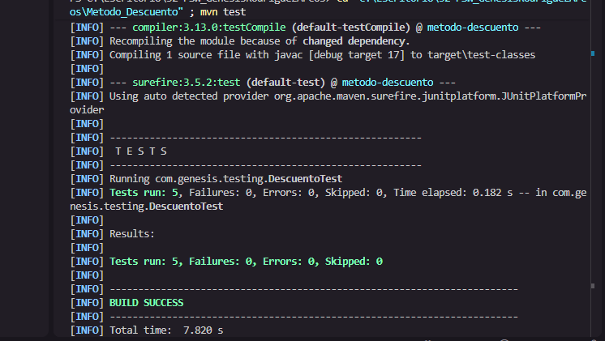

# 32_PSW_GenesisRodriguezArcos

Este repositorio contiene los proyectos desarrollados para la materia de **Pruebas de Software**, donde se aplican pruebas unitarias con JUnit 5 y Maven.

---

## Actividad: Método de Descuentos

Este proyecto se realizó para verificar el comportamiento del método `calcularPrecioFinal`, el cual aplica diferentes porcentajes de descuento a un precio dado.

Se probaron los cuatro casos sugeridos por la actividad y se agregó un **quinto caso propio**: un descuento del 100%, para validar el caso extremo en el que el cliente no paga nada y el resultado debe ser exactamente `0.0`.

### Captura de los tests ejecutados

En la imagen se pueden visualizar los tests realizados, mostrando que los 5 casos pasaron correctamente (`Tests run: 5, Failures: 0`).

